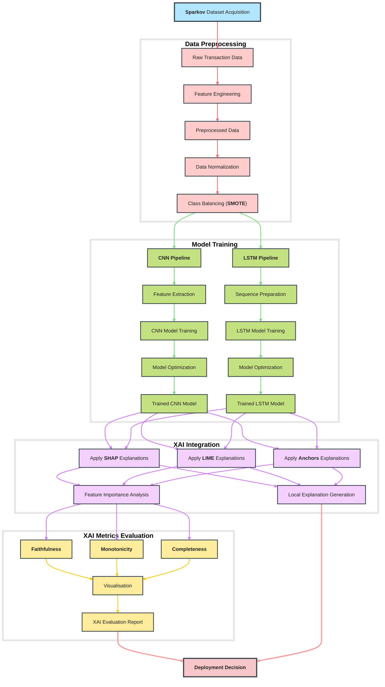

# Explainable AI (XAI) in Deep Learning Models for Credit Card Fraud Detection

[](https://www.python.org/downloads/release/python-31011/)
[](https://www.tensorflow.org/versions/r2.10/api_docs)
[](LICENSE)

- **Documentation:** [Report Documentation.pdf
](https://docs.google.com/viewer?url=github.com/ThongLai/Credit-Card-Transaction-Fraud-Detection-Using-Explainable-AI/blob/main/Report%20Documentation.pdf?raw=true)

- **Main analysis notebook:** [XAI_methods.ipynb](https://github.com/ThongLai/Credit-Card-Transaction-Fraud-Detection-Using-Explainable-AI/blob/main/XAI_methods.ipynb)

- **Run the live main notebook:** [](https://mybinder.org/v2/gh/ThongLai/Credit-Card-Transaction-Fraud-Detection-Using-Explainable-AI/main?urlpath=%2Fdoc%2Ftree%2FXAI_methods.ipynb)

- **Models:** [architectures](https://github.com/ThongLai/Credit-Card-Transaction-Fraud-Detection-Using-Explainable-AI/tree/main/architectures)<a name="models" id="models"></a>

## Description

Credit card fraud represents an important and growing challenge in the financial sector, causing significant monetary losses worldwide. According to the data from the UK Finance, fraudsters stole over £1.3 billion in 2021 alone through authorised and unauthorised fraud, with card fraud accounting for a significant part of these damages [^ukfinance2022]. Detection of fraud transactions presents several important challenges that increase the need for advanced computational approaches.

The project utilized and evaluated the **XAI methods** on **Deep Learning** architectures that are widely known to be used in detecting credit card transaction fraud, including **CNN** and **LSTM** with attention mechanisms, trained on **Sparkov's** synthetic dataset. The main contribution lies in the integration and comparative analysis of three Explainable AI methods: **SHAP**, **LIME** and **Anchors**. Research further evaluates the effectiveness of each XAI method based on **Faithfulness**, **Monotonicity**, and **Completeness** metrics.

<p align="center">
  <a href="https://docs.google.com/viewer?url=github.com/ThongLai/Credit-Card-Transaction-Fraud-Detection-Using-Explainable-AI/blob/main/poster.pdf?raw=true">
    
  </a>
  <br>
  <em>Academic Poster</em>
  <br>
  <em><small><a href="https://docs.google.com/viewer?url=github.com/ThongLai/Credit-Card-Transaction-Fraud-Detection-Using-Explainable-AI/blob/main/poster.pdf?raw=true">(Click to view PDF)</a></small></em>
</p>

**Key Features:**
- **Multi-Model Comparison:**  
  Assess and compare different deep learning architectures for fraud detection.
- **Explainable AI Integration:**  
  - **SHAP:** Interactive visualisations (force plots, summary plots, dependence plots) that elucidate feature contributions.  
  - **LIME:** Local interpretable explanations (in progress) to detail individual predictions.  
  - **Anchors:** Rule-based explanations offering high-precision insights.
- **Robust Evaluation:**  
  - Visual tools to explore feature impacts locally, supporting transparent decision-making.
  - Extensive testing on synthetic data with XAI performance metrics to validate both model interpretability.

## System Architecture

The fraud detection system using XAI comprises several integrated modules:

1. **Data Collection & Model Design:**  
  Gathers synthetic transaction data (**Sparkov** dataset) and design model architectures (CNN, LSTM). Data is loaded and versioned for reproducibility.
2. **Data Preprocessing:**  
  Raw transaction data is cleaned, normalised, and balanced using the **SMOTE** method.
3. **Model Training:**  
  Separate pipelines are implemented for training the **CNN** and **LSTM** models.
4. **XAI Integration:**  
  Post-training, XAI techniques are applied to generate explanations
for model predictions.
5. **Explainability Performance Evaluation:**  
  Comprehensive XAI evaluation metrics, including **Faithfulness**, **Monotonicity**, and **Completeness** are computed.


<p align="center">
  <br>
  <em>System Architecture Diagram</em>
  <br>
  <em><small>Can't see the diagram? <a href="https://github.com/ThongLai/Credit-Card-Transaction-Fraud-Detection-Using-Explainable-AI/blob/main/visualisation/system_architecture.png">View system architecture image</a></small></em>
</p>


## Data Sources

- **Synthetic Data Generation**: To generate synthetic credit card transaction data, including fraudulent transactions, refer to the [Sparkov Data Generation repository](https://github.com/namebrandon/Sparkov_Data_Generation).
- **Combined Dataset**: The combined dataset from Sparkov Data Generation, converted into a standard format, can be accessed [here on Kaggle](https://www.kaggle.com/datasets/kartik2112/fraud-detection).

## XAI Methods Evaluation

### Summary Performance Results
| Method  | Faithfulness | Monotonicity | Completeness |
|---------|--------------|--------------|--------------|
| SHAP    | 0.602        | 0.447        | 0.171        |
| LIME    | 0.325        | 0.467        | 0.217        |
| Anchors | 0.364        | 0.478        | 0.028        |

## Key Visualizations

### Feature Importance Analysis
<p align="center">
  
  <br>
  <em>SHAP values showing global feature importance across the dataset</em>
</p>

### Local Explanation Example
<p align="center">
  
  <br>
  <em>LIME explaining an individual fraud prediction</em>
</p>

### Rule-Based Insights
<p align="center">
  
  <br>
  <em>Anchors generating interpretable rules for fraud detection</em>
</p>

## Key Findings
- **Explainability Analysis**:
  - **SHAP** demonstrated the highest faithfulness (0.602), providing the most reliable feature attributions.
  - **LIME** showed balanced performance across metrics with good completeness (0.217).
  - **Anchors** excelled in monotonicity (0.478) but with limited coverage (0.028).
- **Feature Importance**: Transaction `amount`, `merchant` `category`, and transaction `hou`r emerged as the most influential features across both models.
- **Confidence Analysis**: XAI methods showed varying performance across prediction confidence levels, with SHAP maintaining the most consistent performance (0.544-0.629 faithfulness) across all confidence bins.

This repository is a valuable resource for researchers and practitioners interested in the intersection of fraud detection and explainable AI , providing a foundation for further exploration and development in this critical area of financial security.

## Project Directory Hierarchy
```
Project Root/
├── XAI_methods.ipynb ............................ Explainable AI methods implementation  
├── Siddhartha_CNN.ipynb ......................... CNN model implementation  
├── Ibtissam_LSTM.ipynb .......................... LSTM model implementation  
├── utils.py ..................................... Utility functions  
├── requirements.txt ............................. Dependencies  

├── architectures/ ............................... Trained model storage  
│   ├── model_1_Siddhartha_CNN_acc99/  
│   └── model_2_Ibtissam_LSTM_acc98/  
├── data/ ........................................ Data files and results  
│   ├── predictions.csv  
│   ├── stratified_samples.csv  
│   └── xai_metrics.json  
├── visualisation/ ............................... Visualisation outputs  
├── README.md .................................... Project brief  
├── Report Documentation.pdf ..................... Project Report Documentation
├── presentation.pdf ............................. Project Presentation
├── poster.pdf ................................... Academic Poster
└── .gitignore ................................... Git configuration
```

[^ukfinance2022]: UK Finance. (2022). *Annual Fraud Report 2022*. https://www.ukfinance.org.uk/policy-and-guidance/reports-and-publications/annual-fraud-report-2022