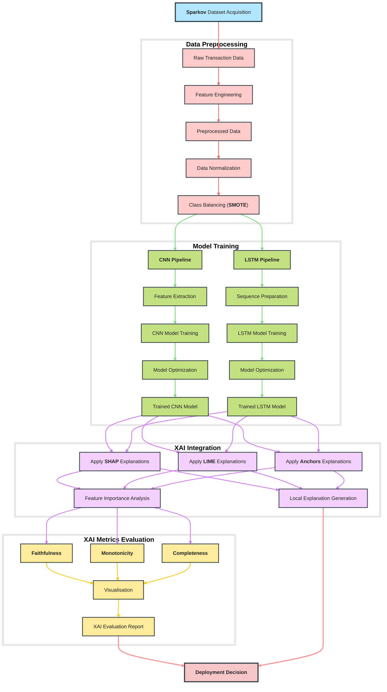

# Explainable-AI (XAI) in Deep Learning Models for Credit Card Fraud Detection

- **Run the live main notebook ([XAI_methods.ipynb](https://github.com/ThongLai/Credit-Card-Transaction-Fraud-Detection-Using-Explainable-AI/blob/main/XAI_methods.ipynb)):** 

- **Models: [architectures](https://github.com/ThongLai/Credit-Card-Transaction-Fraud-Detection-Using-Explainable-AI/tree/main/architectures)**

## Description

This project gathers multiple state-of-the-art **Deep Learning models** used for credit card fraud detection and applies **Explainable AI (XAI)** techniques to enhance their interpretability and enable effective model comparison. We leverage synthetic data from the Sparkov dataset to train and evaluate our models.

**Key Features:**
- **Multi-Model Comparison:**  
  Assess and compare different deep learning architectures for fraud detection.
- **Explainable AI Integration:**  
  - **SHAP:** Interactive visualizations (force plots, summary plots, dependence plots) that elucidate feature contributions.  
  - **LIME:** Local interpretable explanations (in progress) to detail individual predictions.  
  - **Anchors:** Rule-based explanations offering high-precision insights.
- **Robust Evaluation:**  
  - Extensive testing on synthetic data with performance metrics to validate both model accuracy and interpretability.
  - Visual tools to explore feature impacts globally and locally, supporting transparent decision-making.

## System Architecture

The complete workflow includes:
1. **Data & Model Collection:**  
   Obtaining pre-trained fraud detection models and synthetic transaction data.
2. **Model Development Pipeline:**  
   Steps include data preprocessing, feature engineering, model training, evaluation, and hyperparameter tuning.
3. **Prediction & Comparison:**  
   Running inference to generate predictions and comparing performance across models.
4. **Explainability Analysis:**  
   Applying XAI methods (SHAP, LIME, Anchors) to reveal and compare how features drive model predictions.

<em>System Architecture Diagram</em>

## Data Sources

- **Synthetic Data Generation**: To generate synthetic credit card transaction data, including fraudulent transactions, refer to the [Sparkov Data Generation repository](https://github.com/namebrandon/Sparkov_Data_Generation).
- **Combined Dataset**: The combined dataset from Sparkov Data Generation, converted into a standard format, can be accessed [here on Kaggle](https://www.kaggle.com/datasets/kartik2112/fraud-detection).

This repository is a valuable resource for researchers and practitioners interested in the intersection of fraud detection and explainable AI, providing a foundation for further exploration and development in this critical area of financial security.

This repository provides a comprehensive resource for researchers and practitioners focused on leveraging explainable AI to improve the transparency and performance of deep learning models in credit card fraud detection.